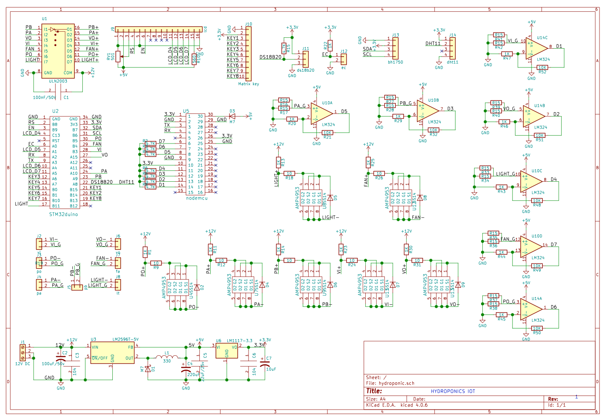
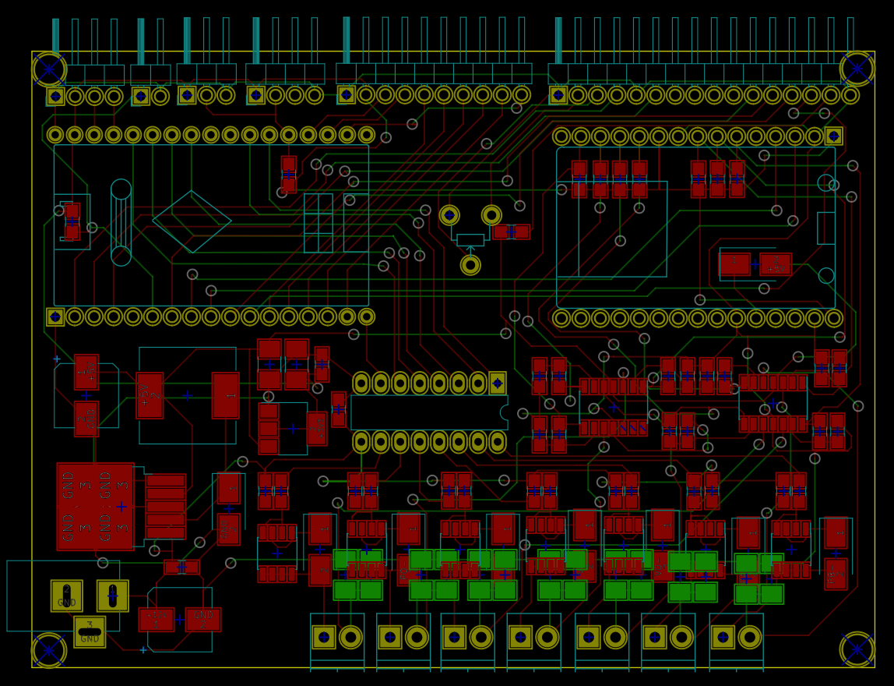
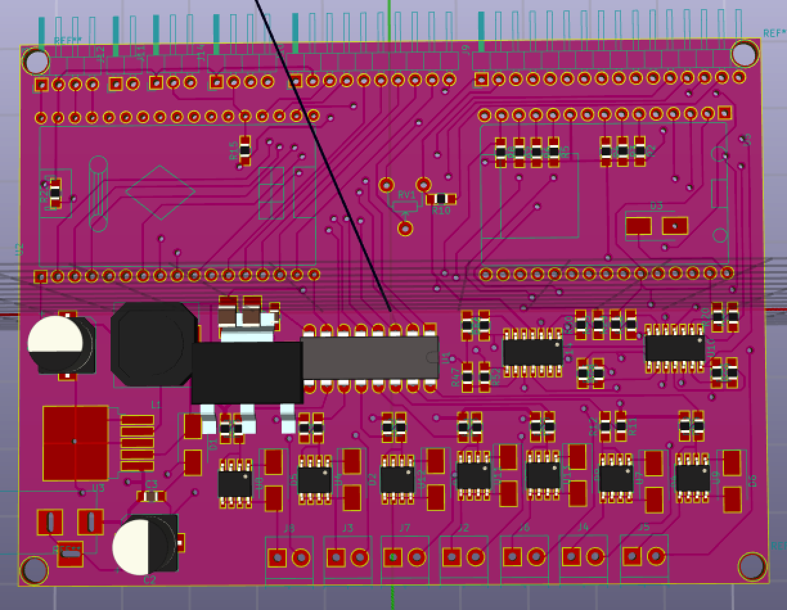

# Hydroponics hardware
Mạch thủy canh thông minh
## Yêu cầu thiết kế
-Nguồn vào 12V DC dùng LM2596 => 5V
- IC dùng module Maple Mini + NodeCMU
- Đọc các giá trị cảm biến DS18b20, Dht11, EC, Bh1750 , water level
- Sử dụng Touchpad key 2x4 để tương tác
- Sử dụng LCD16x2 để hiển thị các thông số cảm biến và trạng thái
- Tương tác với người dùng thông qua giao App Blynk
## Tổng quan
### Sơ đồ nguyên lý

### PCB

### 3D

### TOP

